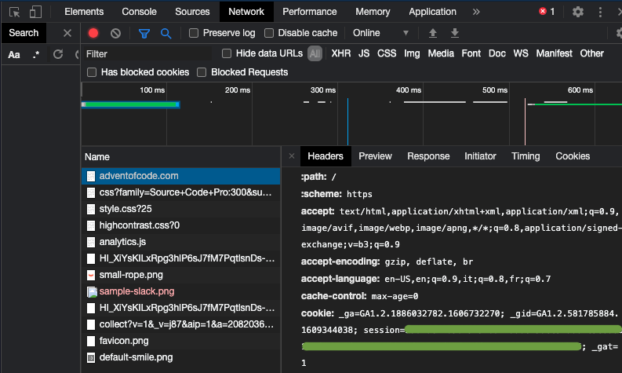
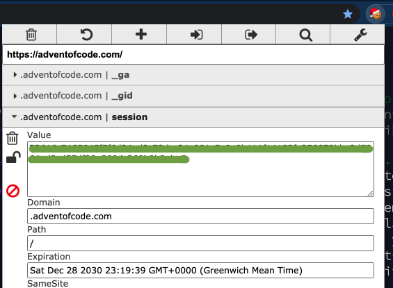

# Advent of Code - Personal Data REST API

Simple Rest API that:
 - logs into https://adventofcode.com/ using a user's session cookie
 - scrapes the "Events" page and retrieved the number of stars obtained for each year
 - serves the result as JSON list in a convenient format.
 
 Sample response:
 
 ```
 [
    {
        "year": 2020,
        "stars": 50
    },
    {
        "year": 2019,
        "stars": 45
    },
    {
        "year": 2018,
        "stars": 37
    },
    {
        "year": 2017,
        "stars": 36
    },
    {
        "year": 2016,
        "stars": 12
    },
    {
        "year": 2015,
        "stars": 0
    }
]
 ```

## Setup
Rename `application.properties.local` to `application.properties` and paste your https://adventofcode.com session cookie in the file. This can be obtained by logging into your AoC account (e.g. via Github, Reddit or Twitter) and copying the string from the request headers.





You can either run the app in the IDE or in a Docker container, via 

```bash
$ docker.sh
```
